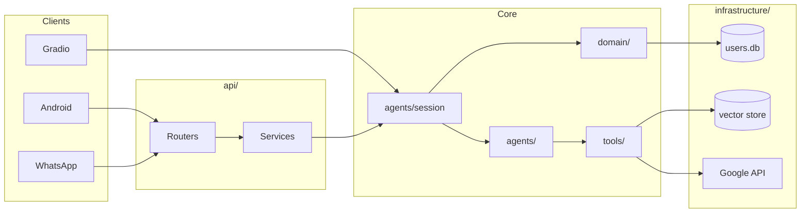

# Plan de refactor — Jarvis

Documento de arquitectura objetivo y migración por fases. Prioridad: **no romper** el contrato público actual (`ask_jarvis`, endpoints existentes, `main.py` / `app.py`).

---

## 1. Estructura objetivo

Árbol final previsto (algunas carpetas se crean vacías en fases tardías):

```
jarvis/
├── core/                          # Configuración y tipos compartidos
│   ├── config.py                  # (migrado desde raíz)
│   └── enums/
│       └── core_enums.py
│
├── domain/                        # Reglas de negocio sin HTTP ni LangChain
│   ├── chat/
│   │   ├── chat_state.py          # ChatState enum + transiciones
│   │   └── session_orchestrator.py  # Lógica de turno (antes parte de JarvisSession)
│   ├── users/
│   │   ├── identification.py      # find_user_by_prompt, protocolos ID
│   │   └── prompts.py             # system prompts / welcome messages
│   └── security/                  # Políticas (MAC, IP) — fase 5
│       ├── mac_policy.py
│       └── ip_policy.py
│
├── agents/                        # LangGraph / LangChain (sin cambiar concepto)
│   ├── factory.py
│   ├── jarvis_basic_agent.py
│   ├── jarvis_memory_agent.py
│   ├── jarvis_mcp_memory_agent.py
│   └── session.py                 # Fachada fina → domain + agents (compat)
│
├── tools/                         # Herramientas LLM (+ nuevas por roadmap)
│   ├── tools_registry.py
│   ├── calc.py
│   ├── date_time.py
│   ├── google_calendar.py
│   ├── speech_to_text.py
│   ├── files/                     # PDF, lectura archivos (roadmap)
│   │   └── read_pdf.py
│   └── messenger/                 # Mensajes entre usuarios (roadmap)
│       └── send_message.py
│
├── rag/                           # RAG + vector store (roadmap)
│   ├── ingest/
│   ├── retriever.py
│   └── vector_store/
│
├── mcp/
│   ├── server_config.json
│   └── servers/
│
├── infrastructure/              # Adaptadores externos (I/O, terceros)
│   ├── persistence/
│   │   └── users/
│   │       ├── repository.py      # Solo SQL CRUD
│   │       └── users_db.py        # (re-export o deprecación gradual)
│   ├── google/
│   │   └── jarvis_google_authentication.py
│   ├── firebase/
│   │   └── url_publisher.py
│   ├── notifications/
│   │   └── telegram.py
│   ├── tunnel/
│   │   └── cloudflared.py
│   └── crypto/
│       └── fernet.py              # (desde utils/security.py)
│
├── api/                           # Capa HTTP FastAPI
│   ├── main.py                    # Bootstrap: app + lifespan + uvicorn
│   ├── dependencies.py            # verify_jwt, get_current_user
│   ├── schemas/
│   │   ├── auth.py
│   │   ├── chat.py
│   │   └── admin.py
│   ├── routers/
│   │   ├── auth.py                # POST /token, GET /validate-token
│   │   ├── chat.py                # POST /ask, GET /message-history
│   │   ├── webhooks.py            # POST /whatsapp
│   │   └── admin.py               # reset-global, cache-status, ...
│   └── services/
│       ├── auth_service.py
│       └── chat_service.py        # Delega en agents.session.ask_jarvis
│
├── interfaces/                    # Puntos de entrada no-API
│   ├── cli.py                     # (main.py)
│   └── gradio_app.py              # (app.py)
│
├── clients/                       # Multi-cliente (roadmap)
│   └── android/                   # App o contrato OpenAPI compartido
│
├── data/                          # Datos locales (gitignore donde aplique)
│   ├── users.db
│   └── docs/
│
├── database/                      # Scripts/notebooks de mantenimiento (opcional renombrar a scripts/)
│   └── users/
│
├── demos/
├── tests/                         # Nuevo — ver fase 2
│   ├── unit/
│   ├── integration/
│   └── conftest.py
│
├── docs/
│   └── REFACTOR_PLAN.md           # Este archivo
│
├── .env.example
├── requirements.txt
├── README.md
├── app.py                         # Shim: from interfaces.gradio_app import demo
└── main.py                        # Shim: from interfaces.cli import main
```

### Principios

| Capa | Responsabilidad | No debe |
|------|-----------------|--------|
| `interfaces/` | UI, CLI, arranque Gradio | Llamar SQL o Firebase directo |
| `api/routers` | HTTP, validación Pydantic, status codes | Construir prompts ni grafos |
| `api/services` | Orquestar caso de uso por request | Detalles de LangGraph |
| `domain/` | Reglas Jarvis (ID, estados, textos) | Importar FastAPI |
| `agents/` | Grafos, memoria, tools | JWT, SQLite |
| `infrastructure/` | DB, APIs Google, Telegram, cifrado | Lógica de conversación |
| `tools/` | Funciones invocables por el LLM | Auth de usuarios |

---

## 2. Contrato de compatibilidad (no romper)

Mantener hasta al menos la **fase 3** inclusive:

```python
# agents/session.py — API pública estable
ask_jarvis(prompt, model, thread_id, user_info=None) -> list[str]
reset_session(thread_id, model=DEFAULT_MODEL)
reset_cache_global()
get_cache_status()
get_message_history(thread_id, model=DEFAULT_MODEL)
check_individual_session_cache_exists(thread_id, model=DEFAULT_MODEL)
```

**Endpoints HTTP** (mismas rutas y payloads):

- `POST /token`, `POST /ask`, `POST /whatsapp`
- `POST /reset-session`, `POST /admin/reset-global-memory`
- `GET /admin/cache-status`, `GET /individual-cache-status`, `GET /message-history`, `GET /validate-token`

**Entrypoints:**

- `python main.py` → sigue funcionando (vía shim o `interfaces/cli.py`)
- `python app.py` / Gradio Space → `app_file: app.py` sin cambiar en HF hasta fase 4 opcional
- `python api/main.py` (o `api/main_api.py` deprecado con redirect)

---

## 3. Fases de migración

### Fase 0 — Preparación (1 PR, bajo riesgo)

**Objetivo:** Base para tests y docs sin mover lógica.

| Tarea | Detalle |
|-------|---------|
| Migrar a **uv** | `pyproject.toml` con dependencias, `uv.lock`, `.python-version`, `uv sync`; `requirements.txt` generado con `uv export` (Hugging Face / Render) |
| Docstrings y contratos | Módulos de producción: docstring de módulo/clase/función con **Args** y **Returns** (y **Raises** si aplica) |
| Crear `docs/REFACTOR_PLAN.md` | Hecho |
| Crear `tests/` + pytest (grupo dev uv) | Tests de humo: import `ask_jarvis`, factory, enums, rutas API |
| Corregir README | Instalación con `uv`, sección Development, enlace a este doc |
| Renombrar endpoint duplicado | `admin_cache_status` / `individual_cache_status` |
| Eliminar `sys.path.append` | Paquete editable: `uv sync` instala `jarvis` en el entorno |

**Criterio de done:** `uv run pytest` verde; comportamiento idéntico; docstrings en código de producción.

**Estado:** completada (incl. uv, docstrings, compat LangChain 1.x en tools, alias `reset_cache`, fix `JarvisBasicAgent`).

---

### Fase 1 — Desacoplar API (2–3 PRs)

**Objetivo:** Partir el monolito `api/main_api.py` sin cambiar contratos.

**PR 1.1 — Schemas y dependencias** ✅

```
api/schemas/auth.py      → TokenResponse
api/schemas/chat.py      → AskInput, ThreadIdPayload
api/dependencies.py      → verify_jwt_token, security schemes, encode_jwt, build_token_payload*
```

**PR 1.2 — Routers** ✅

```
api/routers/auth.py      → /token, /validate-token
api/routers/chat.py      → /ask, /message-history, /reset-session, /individual-cache-status
api/routers/webhooks.py  → /whatsapp
api/routers/admin.py     → /admin/*
```

**PR 1.3 — Services + bootstrap** ✅

```
api/services/auth_service.py   → login, validate response
api/services/chat_service.py   → ask, history, reset, whatsapp
api/services/admin_service.py  → reset global, cache status
api/deployment.py              → cloudflared, Firebase, Telegram
api/main.py                    → create_app(), main(), uvicorn
api/main_api.py                → shim de compatibilidad
```

**Criterio de done:** Mismas respuestas JSON; tests de integración con `TestClient` para rutas críticas.

---

### Fase 2 — Dominio y persistencia (2 PRs)

**Objetivo:** Sacar reglas de `JarvisSession` y SQL mezclado.

**PR 2.1 — Repositorio de usuarios** ✅

- `infrastructure/persistence/users/repository.py`: SQL CRUD (sin `find_user_by_prompt`).
- `database/users/users_db.py` → re-exporta repository + `find_user_by_prompt` desde domain.

**PR 2.2 — Dominio chat/usuarios** ✅

- `domain/users/identification.py` ← `find_user_by_prompt`
- `domain/users/prompts.py` ← welcome / background / respuesta sin ID
- `domain/chat/chat_state.py` ← `ChatState`, `compute_next_chat_state`, `should_clear_agent_thread_on_identification`
- `agents/session.py` → `JarvisSession` delega en domain; **misma firma** `ask_jarvis`.

**Criterio de done:** Tests unitarios de identificación y transiciones de estado sin LLM.

---

### Fase 3 — Interfaces y core (1–2 PRs)

**Objetivo:** Entrypoints claros; config centralizada.

| Origen | Destino |
|--------|---------|
| `config.py` | `core/config.py` + `from core.config import *` en raíz (shim) |
| `enums/` | `core/enums/` + shim |
| `main.py` | `interfaces/cli.py`; `main.py` = 3 líneas |
| `app.py` | `interfaces/gradio_app.py`; `app.py` = launch shim |
| `utils/security.py` | `infrastructure/crypto/fernet.py` + shim en `utils/` |

**Criterio de done:** README actualizado; Hugging Face sigue usando `app.py`.

**Estado:** completada — `core/`, `interfaces/`, `infrastructure/crypto/fernet.py`, shims en raíz.

---

### Fase 4 — Roadmap técnico (paralelo por feature)

Cada ítem = carpeta + PR independiente. Orden sugerido según dependencias:

| Roadmap | Ubicación | Notas |
|---------|-----------|--------|
| Thread conversation management | `domain/chat/threads.py`, `api/routers/chat.py` | `thread_id` ya existe; formalizar modelo y límites |
| Multi-client management | `clients/`, `api/services/client_registry.py` | Client ID en JWT o header |
| WhatsApp bot | `api/routers/webhooks.py` | Ya hay stub; mover lógica a `chat_service` |
| WhatsApp audio + STT | `tools/speech_to_text.py` + servicio en `chat_service` | Reutilizar flujo de `gradio_app` |
| Tool PDF / files | `tools/files/` | Registrar en `tools_registry` |
| RAG + Vector DB | `rag/` | Agente opcional en `factory.py` |
| DB via LLM | `tools/db_query.py` + `infrastructure/persistence/` | Solo lectura parametrizada al inicio |
| Prompt injection detection | `domain/security/prompt_guard.py` | Middleware pre-`ask_jarvis` |
| Build agent after identification | `agents/factory.py` + `session.py` | Lazy build por `thread_id` (roadmap optimization) |
| Android app | `clients/android/` | Consumir OpenAPI; publicar spec desde FastAPI |
| Messenger entre usuarios | `tools/messenger/` + tabla SQLite | Nuevo repository |
| MAC / IP security | `domain/security/` + `api/dependencies.py` | Logs en `infrastructure/` |
| CrewAI | `agents/crew/` o paquete aparte | No mezclar con LangGraph principal |
| Home devices | `tools/home/` o MCP server | Igual patrón que `math_server` |
| Fine-tuning | `training/` (fuera del runtime API) | Scripts offline |

---

### Fase 5 — Hardening producción

- Caché de sesiones/agentes detrás de interfaz (`SessionCachePort`) para tests y Redis futuro.
- Variables de entorno validadas al arranque (`pydantic-settings`).
- OpenAPI versionado; changelog de API.
- Eliminar shims deprecados (`main_api.py`, imports raíz antiguos).
- Opcional: paquete `src/jarvis/` si se publica en PyPI.

---

## 4. Mapa roadmap → arquitectura



---

## 5. Orden recomendado de PRs (checklist)

```
[x] Fase 0: uv, docstrings, tests/, README, cache_status, pyproject.toml + uv sync
[x] Fase 1.1: api/schemas + api/dependencies
[x] Fase 1.2: api/routers (auth, chat, webhooks, admin)
[x] Fase 1.3: api/services + api/main.py + shim main_api.py
[x] Fase 2.1: users repository
[x] Fase 2.2: domain/chat + domain/users + slim JarvisSession
[x] Fase 3: interfaces/ + core/ + shims raíz
[ ] Fase 4+: una feature del roadmap por PR
[ ] Fase 5: quitar shims, cache abstraction, settings validation
```

---

## 6. Ejemplo mínimo post–fase 1

**`api/services/chat_service.py`**

```python
from enums.core_enums import ModelEnum
from agents.session import ask_jarvis, reset_session, get_message_history

class ChatService:
    def ask(self, message: str, model: ModelEnum, thread_id: str, user_info: dict) -> list[str]:
        return ask_jarvis(message, model, thread_id, user_info=user_info)

    def reset(self, thread_id: str) -> None:
        reset_session(thread_id)

    def history(self, thread_id: str, model: ModelEnum = ...) -> list:
        return get_message_history(thread_id, model)
```

**`api/routers/chat.py`**

```python
@router.post("/ask")
async def ask_json(input_data: AskInput, user=Depends(verify_jwt_token)):
    return {"response": chat_service.ask(...)}
```

La lógica pesada sigue en `agents/session.py` hasta la fase 2.

---

## 7. Qué no hacer (anti-patrones)

- Renombrar `ask_jarvis` o cambiar su retorno a `str` único (rompe Gradio, API, tests).
- Mover grafos LangGraph a `api/` (acopla HTTP con LLM).
- Crear `controllers/` que dupliquen `routers/` sin necesidad — en FastAPI el router **es** el controller.
- Refactor grande en un solo PR (difícil de revisar y revertir).
- Borrar `demos/` — son documentación viva del proyecto.

---

## 8. Métricas de éxito

| Métrica | Objetivo |
|---------|----------|
| Tests automatizados | ≥ 15 tests unitarios/integración tras fase 2 |
| `main_api.py` | < 30 líneas (solo shim) tras fase 1 |
| `JarvisSession` | < 120 líneas tras fase 2 (resto en domain) |
| Tiempo de onboarding | README + este doc + árbol estándar |
| Regresión manual | `python main.py`, `python app.py`, `POST /ask` con JWT |

---

## 9. Siguiente paso inmediato

Empezar por **Fase 0** (tests + fix menor en API + README). Si quieres implementación en código, indica si prefieres:

1. Solo Fase 0 ahora, o  
2. Fase 0 + Fase 1.1 en el mismo sprint.
